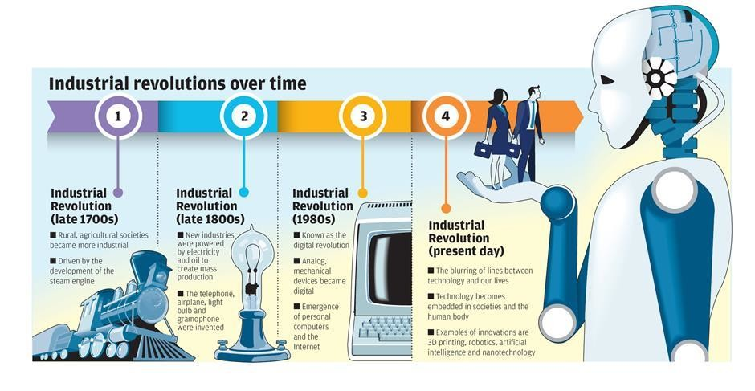

### **산업혁명**

#### - 제1차 산업 혁명
최초의 산업 혁명은 유럽과 미국에서 약 1760년에서 1820년 사이에 걸쳐 일어났다. 주로농경 사회와 농촌 사회에서 산업과 도시로 전환되었다. 철강 산업은 증기 엔진의 개발과 함께 산업 혁명에서 핵심적인 역할을 수행했다.

#### - 제2차 산업 혁명
제2차 산업 혁명은 제1차 세계 대전 직전인 1870년에서 1914년 사이에 일어났다. 기존 산업의 성장기였고 철강, 석유 및 전기 분야와 같은 신규 산업의 확장과 대량 생산을 위해 전력을 사용했다. 이 기간 동안 주요 기술 진보는 모터, 전화, 전구, 축음기 및 내연 기관을 포함했다.

#### - 제3차 산업 혁명
제3차 산업 혁명 또는 디지털 혁명은 아날로그 전자 및 기계 장치에서 현재 이용 가능한 디지털 기술에 이르는 기술의 발전을 가리킨다. 1970년대에 시작된 이 시대는 계속되고 있다. 제3차 산업 혁명의 발전에는 개인용 컴퓨터, 인터넷 및 정보 통신 기술 (ICT)이 포함된다.

#### - 제4차 산업 혁명
제4차 산업 혁명은 기술이 사회와 심지어 인간의 신체에도 내장되는 새로운 방식을 대표하는 디지털 혁명 위에 구축되고 있다. 제4차 산업 혁명은 로봇 공학, 인공 지능, 나노 기술, 양자 컴퓨팅, 생명 공학, IoT, 3D 인쇄 및 자율차량을 비롯한 여러 분야에서 새로운 기술 혁신이 나타나고 있다.

