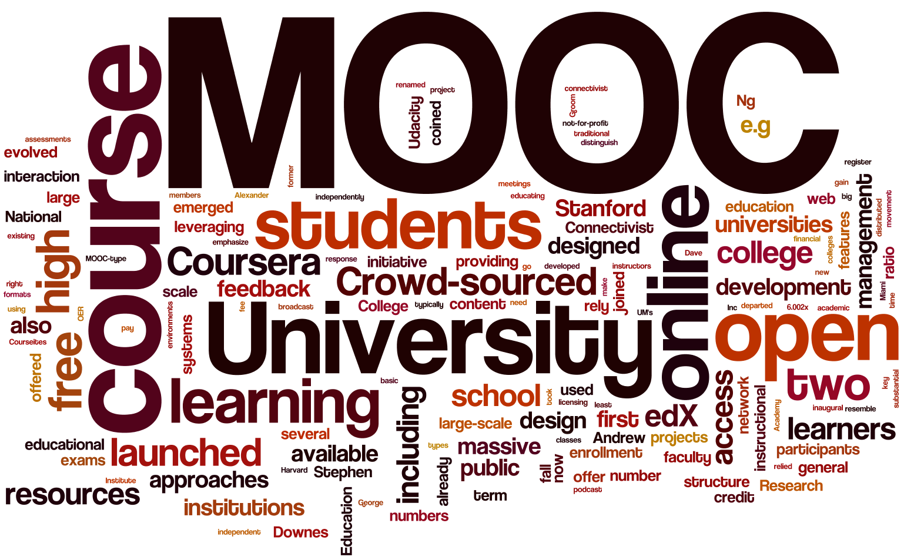

### MOOC (Massive Open Online Course)

대규모 사용자를 대상으로 제공하는 온라인 공개 수업
교육에 대한 패러다임의 변화를 가져올 것으로 기대

온라인에서 대학 강의를 수강할 수 있음
무료/유료 강의가 있음
선택에 따라 수료증(학위)을 받을수 있다.
온라인으로 과제나 시험도 있고, 그 결과를 받아볼 수 있음

가면 갈수록 학위보다는 직무능력향상을 위해 수강함
그러므로 대학강의 뿐만아니라, 강의 내용도 다양해지고 있음

##### 대표적 MOOC 플랫폼
    - UDACITY
    - COURSERA
    - edX

##### 국내 유명 MOOC
    - KOCW (Korea Open CourseWare)
    - K-MOOC
